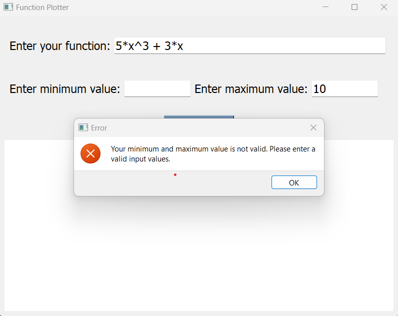

# Function Plotter

 This is a Python GUI program that allows users to plot arbitrary user-entered functions.   
 The program utilizes PySide2 for the GUI components and Matplotlib for plotting the functions.  

## Features
 Users can enter a mathematical function of x.   
 Users can specify the minimum and maximum values of x.    
 Supported operators include +, -, /, *, **, and ^.   
 The program validates user input and provides appropriate error messages.   
 The GUI is well-organized and visually appealing.   
 The Matplotlib figure is embedded within the PySide2 application.   
 Automated tests are included using pytest and pytest-qt for end-to-end testing of the main features.   

## Requirements
 Python 3.7   
 PySide2   
 Matplotlib   
 pytest   
 pytest-qt    

## Snapshots of working and wrong examples.
### Valid input function and valid min and max values. 

### Valid input function for all operation and valid min and max values 

### Invalid input function error in operation. 

### Invalid input function use another char without 'x'.

### Invalid input error in max value.

### Invalid input error in min value.
